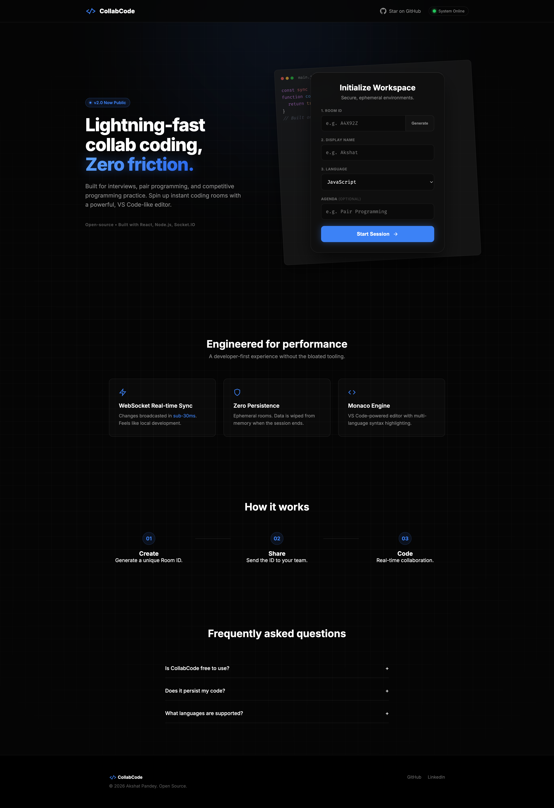
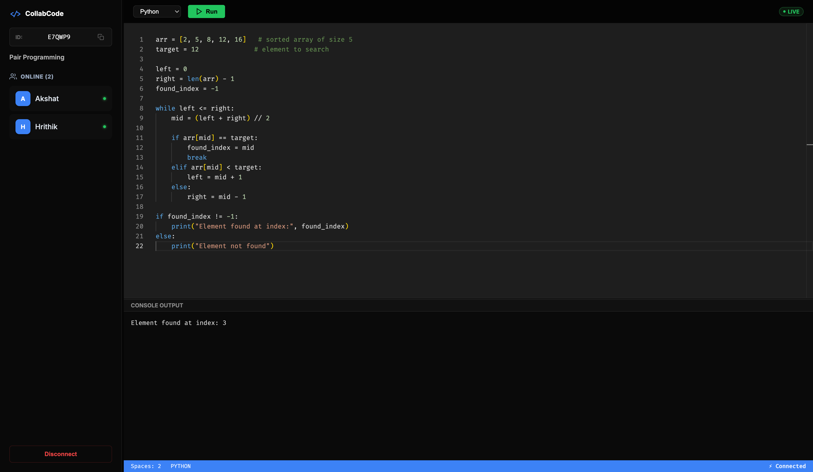

# ⚡ Collab Code
### Real-Time Collaborative Coding Environment

[](https://real-code-editor-4yx6.onrender.com/)
[](https://reactjs.org/)
[](https://nodejs.org/)
[](https://socket.io/)

**Synchronized Coding · Instant Execution · Ephemeral Workspaces**  
*Built for technical interviews, pair programming, and competitive programming.*

---

## 📖 Overview

**Collab Code** is a high-performance, WebSocket-based collaborative code editor that allows multiple users to **write, edit, and execute code simultaneously** in a shared workspace.

The platform follows a **zero-friction design philosophy**:
- No authentication
- Instant room creation
- Fully ephemeral sessions

To deliver a smooth, local-like experience, CollabCode uses **in-memory state management** and **WebSocket-based synchronization**, achieving **sub-30ms latency** between connected clients.

---

## 📸 Interface Preview

### Landing Page


### Collaborative Workspace


---

## ✨ Core Features

- ⚡ **Low-Latency Real-Time Synchronization**  
  Character-level code syncing using **Socket.IO**.

- 💻 **Secure Remote Code Execution**  
  Sandboxed execution via **Piston API**, supporting:
  - JavaScript
  - Python
  - Java
  - C++

- 🎨 **Monaco Editor (VS Code Engine)**  
  IntelliSense and syntax highlighting.

- 📐 **Dynamic & Resizable Layout**  
  Adjustable editor, terminal, and sidebar.

- 👥 **Live Presence Awareness**  
  Real-time user join/leave updates.

- 🛡️ **Privacy by Design**  
  All session data is stored **in memory only**.

---

## 🧠 Engineering Decisions

### WebSockets over HTTP Polling
Enables full-duplex, low-latency communication essential for real-time collaboration.

### In-Memory State vs Redis
Chosen to eliminate network overhead and reduce system complexity for ephemeral sessions.

### Last-Write-Wins (LWW) Strategy
A lightweight concurrency model that avoids CRDT/OT overhead for small collaborative rooms.

---

## 📂 Project Structure

```bash
Real_Code_Editor/
├── .github/              # GitHub Workflows
├── backend/              # Node.js Server Logic
│   └── index.js          # Socket.io & API Entry Point
├── frontend/             # React Client
│   ├── public/           # Static Public Assets
│   ├── src/
│   │   ├── assets/       # Icons & Images
│   │   ├── App.css       # Global Styles (Grid & Flexbox)
│   │   ├── App.jsx       # Main Application Component
│   │   └── main.jsx      # React Entry Point
│   ├── vite.config.js    # Bundler Configuration
│   └── package.json      # Frontend Dependencies
├── 1.png                 # Documentation Asset (Landing)
├── 2.png                 # Documentation Asset (Editor)
├── package.json          # Root Dependencies
└── README.md             # Documentation
```

---

## 🚀 Getting Started

### Prerequisites
- Node.js **v14+**
- npm or yarn

---

### Installation

Clone the repository:
```bash
git clone https://github.com/AkshatPandey2006/Real_Code_Editor.git
cd Real_Code_Editor
```

Install dependencies:
```bash
npm install
cd frontend
npm install
cd ..
```

### Run Locally

This starts:
- Backend on `http://localhost:5000`
- Frontend on `http://localhost:5173`

```bash
npm run dev
```

### 🔌 Socket API Reference

| Event Name  | Direction           | Payload                | Description       |
|------------|---------------------|------------------------|-------------------|
| join       | Client → Server     | `{ roomId, userName }` | Join a room       |
| codeChange | Bidirectional       | `{ roomId, code }`     | Sync code updates |
| syncCode   | Server → Client     | `{ code }`             | Send room state   |
| leaveRoom  | Client → Server     | `null`                 | Leave the room    |

## 🤝 Contributing

Contributions are welcome!

1. Fork the repository
2. Create a feature branch:
   ```bash
   git checkout -b feature/YourFeature
   ```
3. Commit your changes:
   ```bash
   git commit -m "Add YourFeature"
   ```
4. Push to the branch:
   ```bash
   git push origin feature/YourFeature
   ```
5. Open a Pull Request

## 📄 License

This project is licensed under the **MIT License**.  
See the [LICENSE](./LICENSE) file for details.

---

## Feedback

If you have any feedback, please reach out to me at akshat2006pandey@gmail.com

Built with ❤️ by **Akshat Pandey**  
🔗 LinkedIn: https://www.linkedin.com/in/akshatpandey2006
